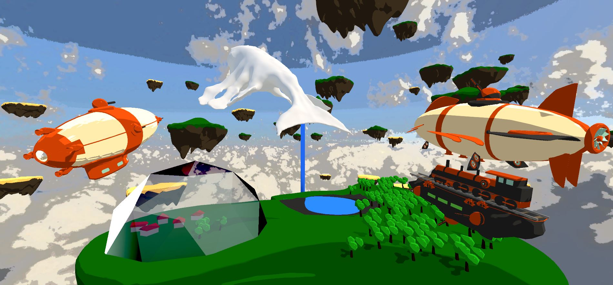
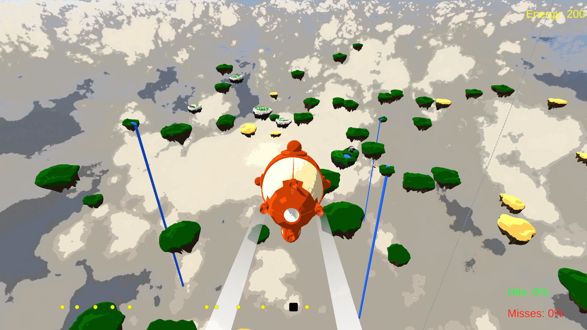
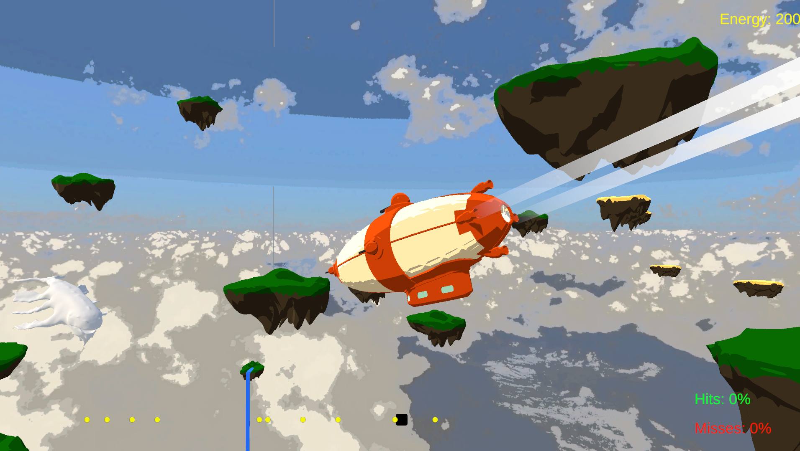
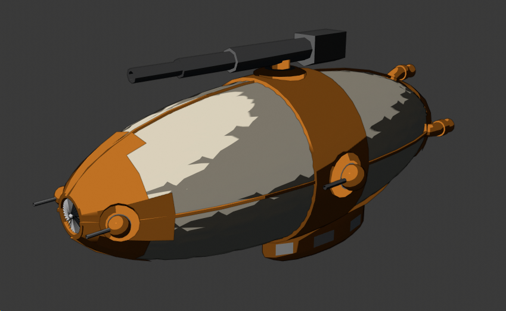
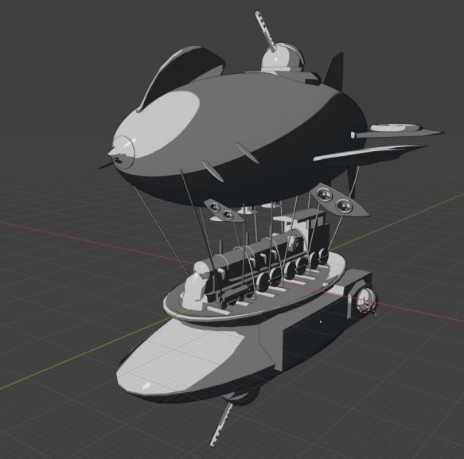
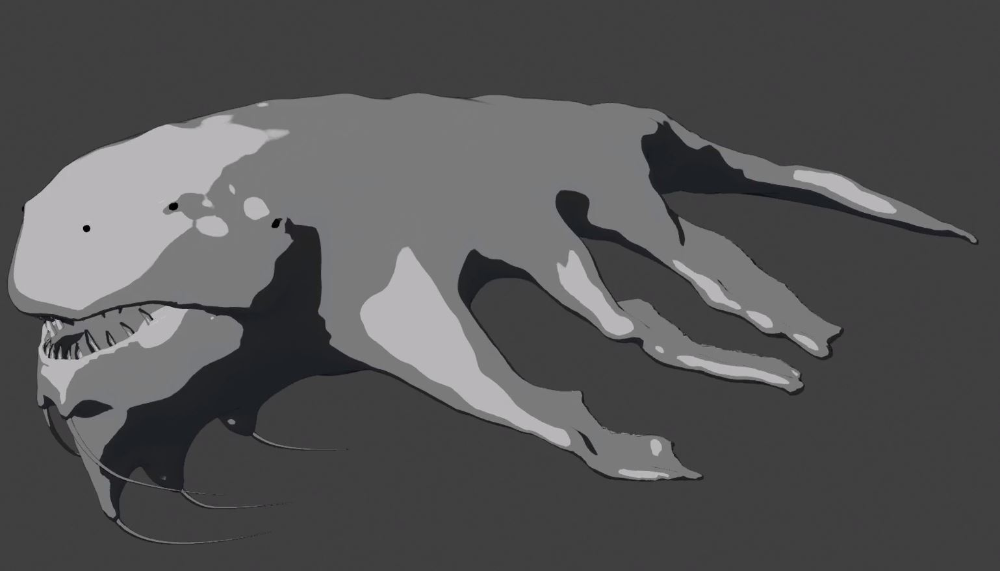
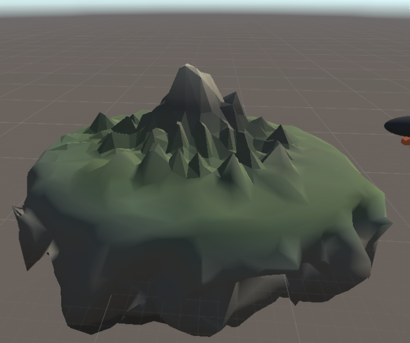

# The Last

Hunt the last living Leviathan, for glory and honor!

# Summary

In this cooperative rhythm game one player must steer an airship while another must constantly hold the beat to charge up energy. The produced energy can be used for shooting as well as for boosting the airship!

This game was created during the 7th GameJam hosted by 3m5 in Dresden. It was the first of its kind, which completely took place online. Three teams with 3-5 people came together to develop games around 15 random topics during 2 days.

# Controls

## Player 1

- To perform flight maneuvers an ordinary gamepad is required. The left as well as the right analog stick can be used for this!
- Few seconds after the start, the airship will loose its motion. To boost the airship again, press the left or right bumper.
- Some pilots might also want to <i>Do a Barrel Role</i> by holding the left or the right trigger button.
  
## Player 2

- The main camera is controlled by the mouse.
- If there is enough charge left, one can release an energy beam by clicking the left mouse button.
- For recharging, the second player has to keep an eye on the bottom of the screen and press the space key when <i>Beat Points</i> enter the highlighted area.

# Goal

The main goal is to navigate the airship right next to the Leviathan and to wound it with the on-board weapons.

# Topics

The main goal at 3m5.GameJams is to pick some of the random topics and to be creative. It does not matter how much topics a team is using, but some characteristics should be recognizable. Mentioning these key words only in some text descriptions is not enough.

| Topic (de) | Topic (en) | Selected |
|-------------------|---------------------|--------------------------|
| Kathodenstrahl | cathode ray | yes |
| Dampflokzeit | steam locomotive | yes |
| Kleeblüte | Clover flower | |
| Renaissancemaler | renaissance painter | |
| Rosette | rosette | |
| Phosphatschicht | Phosphate layer | |
| Lebendexemplar | Living specimen | yes |
| Bötchen | small ship | |
| Narr | fool | |
| Funkenschlag | Sparking | |
| Obstruktionskurs | obstruction course | yes |
| Mediziner | Medical professionals | |
| Königgrätz | (name of a city in Czech Republic) | |
| Militarisierungstendenz | Militarization tendency | |
| formfeed | form feed | |
| Spreizgips | plaster bandage | |
| Kambodscha | (name of a country in Asia) | |
| Zykloidenbogen | Cycloid arch | yes |
| Intervallbreite | interval width | yes |
| Kapitulationsurkunde | Surrender | |

# Screenshots

## Ingame

| Main Scene | Players flying towards the leviathan |
| --- | --- | 
|  |  |

## Early Concepts of Airships

| Airship No. 1 | Airship No. 2 |
| --- | --- | 
|  |  |

## Early Concepts of Environment and Main Characters

| Leviathan | Procedurally generated island |
| --- | --- | 
|  |  |
